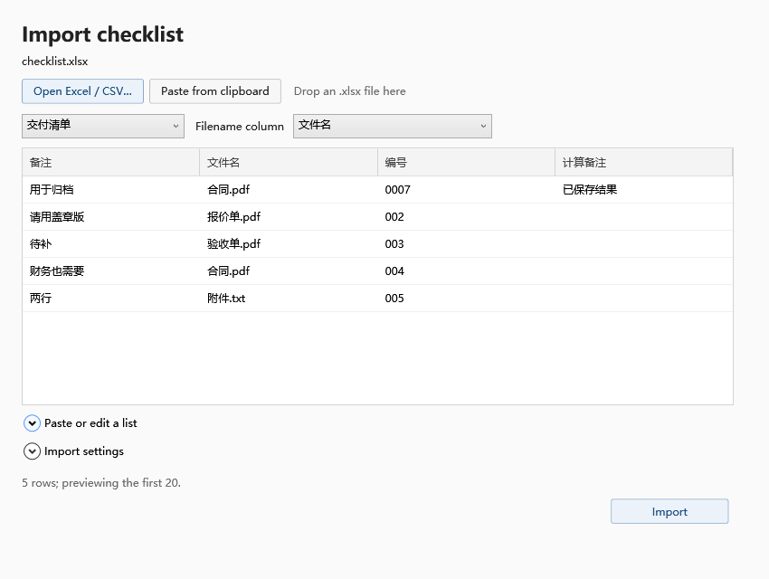

# FileChecklist

Find, check and collect files from an Excel checklist.

[中文](README.zh-CN.md) · [Browser tool](https://qugit104.github.io/FileChecklist/?lang=en) · [Download](https://github.com/qugit104/FileChecklist/releases)

## Usage

1. Open a checklist and select the worksheet and filename column.
2. Select the source folders and scan.
3. Choose between duplicate names, select a destination and preview the copies.



The browser tool checks filenames and exports CSV. The Windows app also copies files, saves tasks and resumes incomplete deliveries.

Supports `.xlsx`, CSV, TSV and pasted Excel cells. Match complete filenames, names without extensions or ID prefixes. ID matches require a file selection.

Excel formulas use saved results. Convert `.xls` files to `.xlsx` first. The desktop app targets Windows 10/11 x64 and ordinary local folders, with a separate flat output folder.

## Development

Requires .NET SDK 9 and Node.js 24.

```powershell
dotnet run --project src/FileChecklist.Desktop -- --lang en
powershell -NoProfile -ExecutionPolicy Bypass -File tools/test.ps1
node --test tests/web/*.test.mjs
node tools/serve-demo.mjs
```

[CLI](docs/CLI.md) · [Browser details](docs/BROWSER.md) · [Third-party components](THIRD-PARTY-NOTICES.md)
