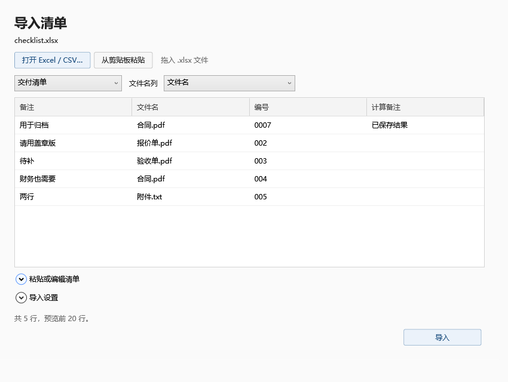

# FileChecklist

按 Excel 清单批量查找、核对和复制文件。

[English](README.md) · [在线核对](https://qugit104.github.io/FileChecklist/?lang=zh) · [下载](https://github.com/qugit104/FileChecklist/releases)

## 使用

1. 打开清单，选择工作表和文件名列。
2. 选择来源文件夹，扫描文件。
3. 确认同名文件，选择交付目录，预览后复制。



网页版支持核对和导出 CSV。Windows 桌面版支持复制、保存任务和补件。

支持 `.xlsx`、CSV、TSV 和粘贴 Excel 单元格。可按完整文件名、不含扩展名或编号前缀匹配。编号匹配需要确认候选文件。

`.xlsx` 使用已保存的公式结果；旧版 `.xls` 请另存为 `.xlsx`。桌面版适用于 Windows 10/11 x64 的普通本地文件夹，输出到独立的平面目录。

## 开发

需要 .NET SDK 9 和 Node.js 24。

```powershell
dotnet run --project src/FileChecklist.Desktop -- --lang zh
powershell -NoProfile -ExecutionPolicy Bypass -File tools/test.ps1
node --test tests/web/*.test.mjs
node tools/serve-demo.mjs
```

[命令行](docs/CLI.md) · [浏览器说明](docs/BROWSER.md) · [第三方组件](THIRD-PARTY-NOTICES.md)
