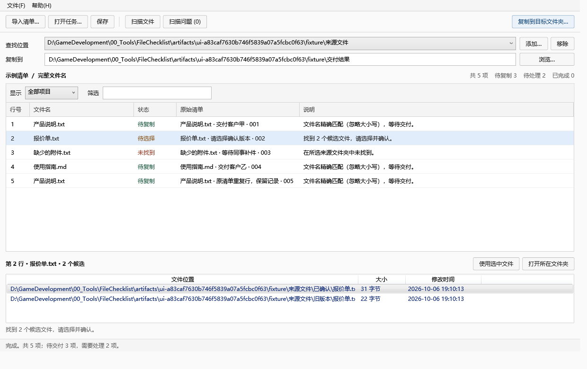
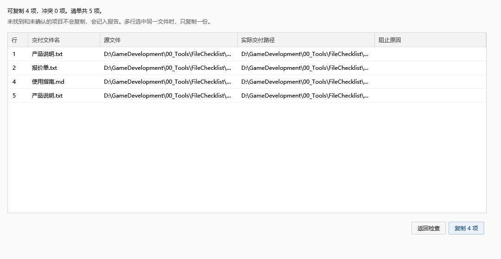

# 清单交付 · FileChecklist

按 Excel 清单批量查找、核对和复制文件。

[English](README.md) · [下载免安装版](https://github.com/qugit104/FileChecklist/releases) · [反馈问题或使用场景](https://github.com/qugit104/FileChecklist/issues/new/choose)

Windows 本地桌面工具。粘贴文件名和备注，递归查找文件；处理重名和缺件后，预览并复制到交付目录。保留原清单的顺序、重复行与备注，每一行都有结果。



适合按客户清单准备材料、整理项目附件、补交缺失文件等场景。

## 开始使用

从 Releases 下载 `FileChecklist-0.2.0-win-x64.zip`，解压后双击 `FileChecklist.exe`，无需安装 .NET。当前桌面版面向 Windows 10/11 x64；尚未逐个系统版本验证。另有 Windows / Linux 命令行版。

1. 点 **导入清单…**：直接粘贴 Excel 多列数据，也可导入 CSV / TSV。指定文件名列；没有表头时取消“第一行是表头”。示例在 **帮助 → 打开示例**。
2. 导入时选择匹配规则：完整文件名、不含扩展名或编号前缀。添加查找位置后点 **扫描文件**。选中“待选择”行，核对文件位置后点 **使用选中文件**。编号前缀的候选即使只有一个，也需要确认。
3. 选择独立的目标文件夹，点 **复制到目标文件夹…**。检查实际目标路径，确认后开始复制。路径太长时悬停查看全文。
4. 保存 `.fctask` 任务。日后补齐文件，打开任务、重新扫描，再交付。本次未找到的项和已完成的项都会保留。



## 当前已实现

- 保留有效数据行的顺序、重复行、备注和原始文本；完全空白行忽略。
- 多来源文件夹递归扫描、同名候选人工选择、缺件和扫描问题提示。
- `A001` 可以按编号找到 `A001_报告.pdf`，不会误匹配 `A0010_报告.pdf`；也支持不含扩展名的精确匹配。
- 复制前预览；禁止覆盖已有目标，可明确选择自动加序号。
- 同一源文件被多行引用时，一次交付共用一份副本，每行独立记录结果。
- 选中文件记录 SHA-256；复制时核对内容变化并校验副本，保留源文件。
- UTF-8 BOM CSV 报告：原清单列、每行状态、源路径、交付路径与校验值。
- 保存 / 恢复任务、自动恢复副本、重新核对后补交新增文件。
- 后台扫描与复制，可以取消；已完成的副本保留，未完成的临时副本清理。

无需登录，不上传文件，无在线服务。

## 第一版边界

- 支持普通本地文件夹；符号链接、目录联接与带重解析属性的云占位文件跳过并记录。网络盘及云盘工作流尚未验证。
- 三种匹配规则均忽略大小写；不做相似度猜测、内容搜索或自动判断业务版本。每行选择一个文件；不同名字的同一内容也不会自动合并。
- 暂不直接读取 `.xlsx`：在 Excel 复制所需单元格即可。支持 UTF-8 CSV / TSV，读取失败时尝试 GB18030。
- 输出为一个平面文件夹，原目录结构不复制。来源与交付目录不能互相包含。
- 清单上限为 100,000 行 / 16,000,000 字符；这个上限不是性能承诺，尚未做十万行或大型目录压测。匹配文件需要读取内容进行校验，大文件会增加扫描时间。
- 编号前导零保存在任务及报告文本中。Excel 直接双击 CSV 可能自动转数字，建议“从文本/CSV”导入并设置文本列。以公式符号开头的报告单元格加前导单引号，避免被执行成公式。
- 自动恢复副本保存在 `%LOCALAPPDATA%\FileChecklist\Recovery`；示例在同目录下的 `Examples`。手动保存的任务是快照，重新打开必须扫描。
- 任务文件和报告包含本地完整路径；自行选择分享范围。当前构建未签名，尚未制作安装器。

## 开发与验证

Windows + .NET SDK 9。WPF 界面与文件处理引擎分离，没有第三方运行时 NuGet 依赖。

```powershell
dotnet run --project tests/FileChecklist.Tests -c Release
dotnet build src/FileChecklist.Desktop -c Release
powershell -NoProfile -ExecutionPolicy Bypass -File tools/test.ps1
powershell -NoProfile -ExecutionPolicy Bypass -File tools/publish.ps1
```

`test.ps1` 运行核心回归、构建，并启动真实 WPF 窗口完成导入、核对、交付、恢复与补件流程。测试数据及恢复设置隔离在临时目录 / `artifacts`，不会读取用户任务。

- `src/FileChecklist.Core`：解析、匹配、状态、复制、校验、报告与任务持久化。
- `src/FileChecklist.Desktop`：WPF 界面及可运行的窗口流程测试。
- `src/FileChecklist.Cli`：命令行预览、确认、复制与补件，[用法](docs/CLI.md)。
- `tests/FileChecklist.Tests`：无外部测试框架依赖的行为回归。
- [0.2 验证记录](docs/RELEASE-0.2.md)。

当前为早期版本。欢迎用虚构的文件名和目录结构反馈具体问题，不需要上传真实业务材料。
